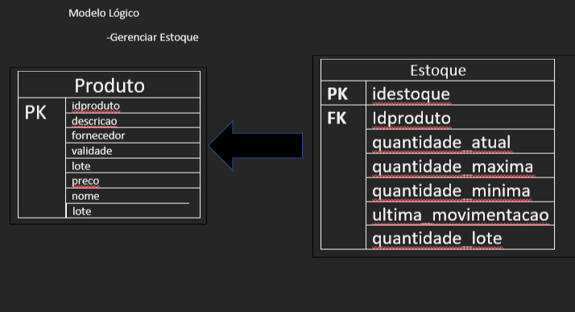

# Estudo de caso
## Casa Oliveira

Roberto é dono de um mercado no bairro de Vargem Grande, na cidade de Tupã. Ele herdou o negócio de seu pai, Gumercindo Oliveira, ela foi aberta em 1978 na garagem da casa da família, era uma pequena quitanda. Com o passar dos anos o negócio cresceu e Gumercindo foi obrigado a ir para outro ponto maior e ali permaneceu até os dias atuais.

Roberto, que agora é o novo dono do mercado continuou o negócio seguindo da mesma forma que o pai. Ele comprava diretamente com os fornecedores grandes volumes de produtos e armazenava em seu estoque. As vezes ele comprava muitos produtos que ainda havia em estoque causando uma sobrecarga de produtos, ele também tinha muitos produtos estragados, tais como: frutas, legumes, iogurtes, leites, frango, etc. Também havia muitos produtos com o prazo de validade vencido.

Os funcionários eram poucos e faziam muitas coisas ao mesmo tempo. O açougueiro também ajudava no estoque, a moça da limpeza ajudava na organização dos produtos das prateleira, além de ajudar na padaria, quanto o caixa estava vazio o operador ajudava a repor os laticínios e a limpar a loja. O repositor também fazia operação no caixa.

Ao realizar a venda o Roberto, que sabia o nome de quase todos os clientes, anotava em um caderno todos os produtos que vendia e que havia em estoque. Ao fim do dia , Roberto pegava o caderno de fazia os cálculos de o quanto havia vendido, somando o faturamento e realizando a atualização do estoque. Isso é feito todos os dias e tomava um tempo considerável para que tudo tenha sido feito.

Roberto fechava a loja as 18h, mas só ia para casa as 22h, após fazer todas as operações necessárias. Mesmo assim o negócio vai bem e Roberto pretende ir para outro ponto e aumentar o volume de negócios e contratar novos funcionários.

Marica, esposa de Roberto, vem conversando com ele há muito tempo para que ele contrate uma empresa para construir um sistema de informática para gerenciar o negócio e reduzir o tempo que ele passa trabalhando e tenha maior organização dos produtos, maior lucratividade e melhorar a gestão.

Com a intenção de aumentar o negócio, Roberto está disposto a informatizar sua empresa. Vamos ajudá-lo. Iremos começar construindo o banco de dados.


### Problemas a solucionar

Falta de funcionarios
Gerenciamento do estoque
Baixa no estoque
Funcionarios multifuncional
Fluxo de caixa: Entrada e saida de valores
Gestão do patrimonio: Computadores, prateleiras, Geladeiras, fogão, Carrinho, caixas, balcões, balança, etc
Setor de compras
Setor financeiro


-Gestão do estoque
-Informações sobre os produtos (fornecedor, marca,validade, lote, descrição, idproduto, categoria)

-Volume de produtos em estoque (quantidade_lote, quantidade_atual,      ultima_movimentação, quantidade_maxima, quantidade_minima, idproduto)


-Funcionário
-informações(nome, função, salario, matricula, cpf,rg,telefone,email, estado civil, admissão, data_nascimento, endereço, usuario, senha, idfuncionario)
				    

-Fluxo de caixa(formas de pagamento, limite_sangria, valor, entrada|saida, registro_venda)

-Gestão de patrimonio(idpatriminio, codigopatrimonio, descrição, valor, nome,  setor_pertencente, data_aquisicao, setor_responsavel, data_baixa)
 
	
	

-setor de compras
-informacao_compras(idcompra, funcionario, valor_pag_produto, fornecedor, data_compra, numero_nota_fiscal, nome_produto, descricao, quantidade,     consumivel, setor_destino)				    


-setor financeiro
-informacao_financeiro(idfuncionario, dispesas, lucro, disponibilidade_cofre, valor, tipo_valor, descricao, data_operacao, identificacao_responsavel)

### Modelo conceitual


### Modelo lógico




---
### Modelo Físico

Código e documentação do modelo fisico

/*
Para o projeto de banco de dados da Casa Oliveira será criado
uma estrutura física com os comandos SQL(Structure Query Language)
Iremos começar com o comando de criação de banco de dados. Este
comando pertence a categoria de comandos DDL(Data Definition Language)
Comando:
	CREATE DATABASE nome_do_banco -> CREATE DATABASE casaoliveira
    
*/
CREATE DATABASE casaoliveira; 
/*
Após a criação do banco de dados é necessário selecioná-lo. Para isso
iremos usar o comando USE nome_do_banco 
*/
USE casaoliveira;

/*
Criação das entidades em modo fisico usando os comando SQL.
Para criari uma tabela(entidade) usaremos o comando
CREATE TABLE nome _da_tabela seguido por parenteses e os 
atributos(campos ) da tabela, bem como a sua tipificação, ou seja,
devemos dizer qual tipo de dados que cada campo(atributo) da tabela
deve receber. Ex: o campo idade deve receber valores 
númericos e, portanto será definido como int(inteiro).

Vamos criar a tabela com os seguintes campos:
	-idproduto, descricao, fornecedor, validade, lote, preco, nome, marca, categoria
``` 
	Para cada será definido um tipo de dado
    para idproduto, iremos definir como: 
	-Chave-Primária (Primary Key) é nosso campo indexador, por ele será
    realizado o relacionamento com outras tabelas;
    -Vamos definir este campo com auto_incremente, o que permite gerar
    os ids de forma automatica. Esse passo é importante, pois elimina alguns problemas, 
    tais como: Concorencia, geração incrementada de valores e exclusividade
    de valores;
	-Vamos definir o campo o tipo de dado numérico int(inteiro).
```     
```   
Para o campo descricao, usaremos o tipo dado Text. Com este tipo podemos inserir
até 64 mil caracteres. Como neste campo pode haver a possibilidade de uma descrição 
longa do produto se faz necessario um tamanho maior.      

Para o campo fornecedor iremos usar o tipo de dado VARCHAR. Este tipo de dado nos permite 
inserir texto mas com um limite que pode ser pré definido pelo usuario ou podemos utilizar 
o limite total de 255 caracteres. Para o fornecedor usarem 50 caracteres.  

Para o campo validade iremos usar o tipo de dado DATE. 

Para o campo lote será definido o tipo de dado VARCHAR, pois há a possibilidade de um valor conter
caracteres alfabecimais. Sendo assim o VARCHAR é uma otima opção por aceitar valores diversos

O campo preço será definido como decimal com esse tipo é possivel inserir valores numericos 
com a aplicação de casas decimais você define o comprimento e deste tamanho é configurado 
as casas decimais Ex: decimal(10,2) -> COMPRIMENTO DE 10 DIGITOS E DESTES TEMOS 2 CASAS DECIMAIS	
VEJA: R$ 11111111,11 -> 11.111.111,11 -> R$ 35.665.235,23

Para os campos nome, marca e categoria será definido como VARCHAR, pois este 
tipo é capaz de receber caracteres de texto . Precisaremos apenas definir o tamanho de cada campo.
Ex: nome pode ficar com tamanho 50, marca pode ficar com 30 e categoria 20
*/
```
```
CREATE TABLE produto(
idproduto int auto_increment primary key,
descricao text, 
fornecedor varchar(50),
validade date,
lote varchar(20),
preco decimal(8,2),
nome varchar(50),
marca varchar(30),
categoria varchar(20)
);
```
```
CREATE TABLE estoque(
idestoque int auto_increment primary key,
idproduto int,
quantidade_maxima int,
quantidade_minima int, 
quantidade_atual int,
ultima_movimentacao date,
quantidade_lote int
);
```